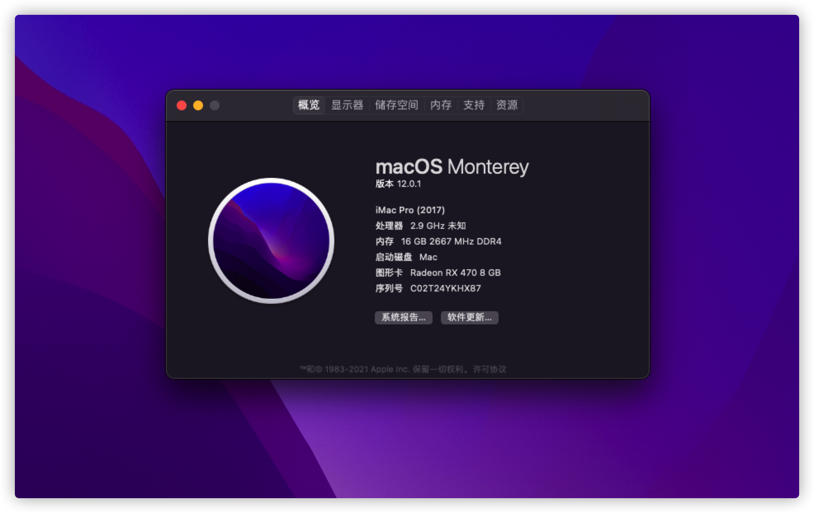

# Asrock-B365M-ITX-AC-Hackintosh-OpenCore

2020疫情期间闲聊无事，接触了黑苹果，就加了一块硬盘弄了个黑苹果，BigSur出来后又折腾了一番，成功升级到BigSur，期间太多坑了，分享一下，方便后来人。

## 硬件配置
我这台黑苹果主机的整体配置清单如下：

- `cpu`：Intel i5 9400F
- `主板`：华擎 B365M-ITX/AC
- `显卡`：蓝宝石 RX560XT 8G
- `硬盘`：光威 悍将 2.5寸 1.5T SSD 
- `内存条`：威刚XPG 8G*2 DDR4
- `散热器`：金河田 9cm四铜管风扇
- `电源`：全汉 450W
- `机箱`：酷鱼 G5 Plus
- `无线网卡`：博通 BCM943602CS

## OpenCore
版本0.6.3，支持GUI界面，图标是我精心挑选组合的一套，不喜欢的可以自行更换，勿喷^_^

## 参考
大部分都借鉴了下面这位老哥的配置
- [B365ITX-Hackintosh-OC 华擎B365ITX 黑苹果OC 配置](https://github.com/Good0007/B365ITX-Hackintosh-OC)

还有官方手册
- [OpenCore Install Guide](https://dortania.github.io/OpenCore-Install-Guide/prerequisites.html)

黑果小兵大神的镜像
- [【黑果小兵】【微信首发】macOS Big Sur 11.0.1 20B29 Installer for CLOVER 5126 and OpenCore 0.6.3 and PE三EFI分区原版镜像](https://blog.daliansky.net/macOS-BigSur-11.0.1-20B29-Release-version-with-Clover-5126-and-OC-0.6.3-and-PE-original-image.html)
